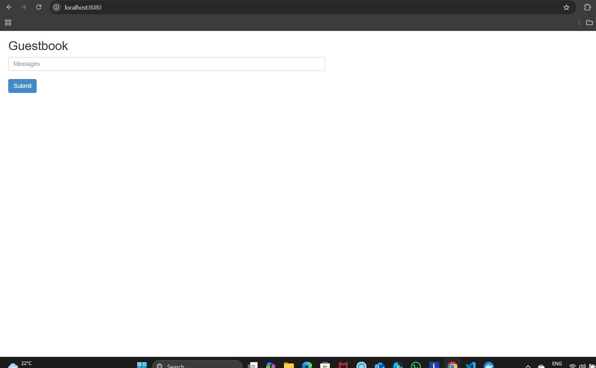
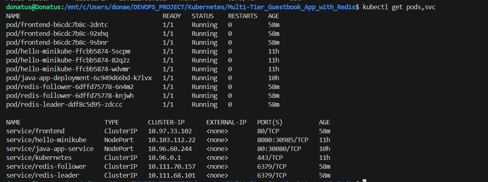

## Kubernetes Guestbook Application

 This is a project I built to get hands-on experience with deploying a multi-tier application on Kubernetes. It is a simple guestbook App where 
 
 users can leave a message, but underneath, it's packed with core DevOps concepts like container orchestration, service discovery, and database replication.

## Project Structure

This repository is kept simple and focused. The main file is all you need to deploy the entire application.

k8s-multi-tier-guestbook/

├── guestbook-all-in-one.yaml  # The complete manifest to deploy everything

├── images/                    # Folder containing application screenshots

│   ├── guestbook-frontend.png

│   └── kubectl-output.png

└── README.md                  # The document you're reading right now

## What's Inside?

In simple terms, this project has three main parts:

## The Website (Frontend): 

- A PHP application that users see in their browser. It's designed to scale out by adding more pods if the site gets busy.

- The Primary Database (Redis Leader): This is the only pod that can write new data. When you submit a message, it goes here first.

## The Read-Replica Databases (Redis Followers): 

- These pods are copies of the main database. Their job is to handle everyone reading the guestbook messages, which takes load off the leader and makes the app faster.

## The magic of Kubernetes is how it keeps all these parts talking to each other reliably.

## Why I Built This

I wanted to move from just reading about Kubernetes to actually deploying something real. This project helped me understand:

- How to define deployments and services in YAML.

- How different components in a cluster discover and talk to each other.

- The practical use of a leader-follower pattern for databases.

- How to troubleshoot real-world issues like missing images and port conflicts.

## Challenges I Ran Into (And How I Fixed Them)

This was not all smooth sailing! Here are a few hiccups I had along the way:

## The Missing Docker Image: 

-The tutorial used an image (gcr.io/google-samples/guestbook-php-redis:1.0) that I could not pull. My pods were stuck in ImagePullBackOff error.

My Solution:

- I built my own Docker image for the PHP frontend and published it to my Docker Hub account (donaemeka/fancy-app:latest). Then I just updated the YAML file to use my image. Problem solved!

## "Port 8080 is already in use":

- When I tried to forward the port to my browser, my terminal yelled at me.

My Solution: 

- I learned the lsof -i :8080 command to find the process that was hogging the port and then free it up. It was a great lesson in basic system troubleshooting.

## Understanding the "Why": At first, I did not get why we needed separate Redis pods for leader and follower.

My Solution: 

- I did some reading and realized it is a classic pattern: having one dedicated writer prevents conflicts and makes the app consistent, while 
multiple readers make it scalable. It finally clicked!

## What I Learned

This project was a huge step forward for me. I got practical experience with:

- Kubernetes Fundamentals: Deployments, Pods, Services (ClusterIP), and kubectl commands.

- Design Patterns: Implementing and understanding the leader-follower pattern for stateful workloads.

- Troubleshooting: Debugging ImagePullBackOff, examining pod logs, and describing resources to find issues.

- Resilience: Seeing how Kubernetes automatically restarts containers and keeps the application available.

## Quick Start: Run It Yourself

If you have a Kubernetes cluster (like Minikube or Docker Desktop), you can run this yourself:

# Clone the repo

git clone https://github.com/donaemeka/k8s-multi-tier-guestbook.git

cd k8s-multi-tier-guestbook

# Deploy everything

kubectl apply -f guestbook-all-in-one.yaml

# Check that the pods are running

kubectl get pods

# Forward a port to your local machine

kubectl port-forward svc/frontend 8080:80

Then, just open http://localhost:8080 in your browser!

## 🖼️ Screenshots

### The Guestbook Application in Action

*The main web interface where users can view past messages and submit new ones.*

### Kubernetes Resources Running Successfully

*Output from `kubectl get pods,svc` showing all running components.*

## Let's Connect!

I am actively looking for junior DevOps or platform engineering opportunities where I can learn, contribute, and grow.

Feel free to check out my GitHub for more projects, or connect with me on LinkedIn. I'm always open to talking about tech, projects, or potential 

opportunities!

## Author

 Donatus Emeka Anyalebechi

## DevOps & Cloud Computing Enthusiast

## GitHub: github.com/donaemeka

## LinkedIn: linkedin.com/in/donaemeka

Thanks for stopping by!